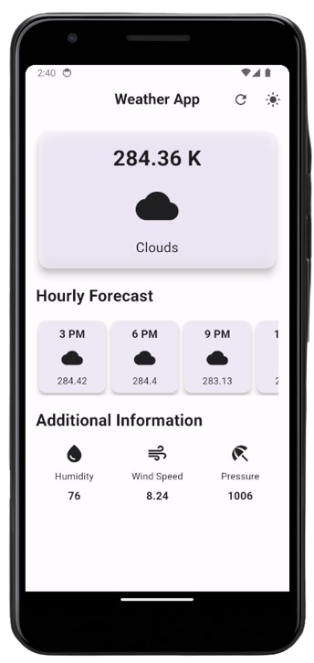
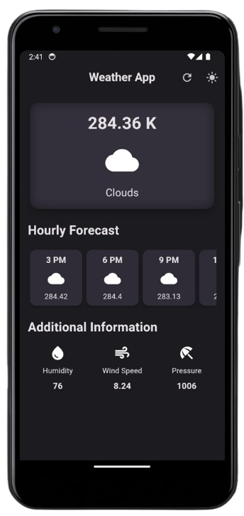

# Flutter Weather App

This Flutter Weather App is designed to provide users with up-to-date weather information using a free API. It offers a clean interface and easy navigation to retrieve weather forecasts for different locations.

## Features

- **Current Weather:** Display current weather conditions for a specified location.
- **5-Day Forecast:** Show a 5-day weather forecast for the selected location.
- **Search Functionality:** Search for weather information by city name or ZIP code.
- **User-Friendly Interface:** Intuitive design for easy navigation and readability.

## Technologies Used

- **Flutter:** Framework for building cross-platform mobile applications.
- **API:** Utilizes a free weather API (mention the name/provider of the API).

## Installation

1. **Clone Repository:** `git clone https://github.com/your-username/your-repo.git`
2. **Navigate to Project:** `cd your-repo`
3. **Install Dependencies:** `flutter pub get`
4. **Run the App:** `flutter run`

## Configuration

To use the weather data, you'll need an API key from the chosen weather service provider. Once you have the API key, follow these steps:

1. **Create a Secrets File:** Create a `secrets.dart` file in the `lib` directory.
2. **Store API Key:** Inside `secrets.dart`, define a variable to store your API key.
   ```dart
   const String apiKey = 'YOUR_API_KEY_HERE';

# Preview 
### Light Mode


### Dark Mode

